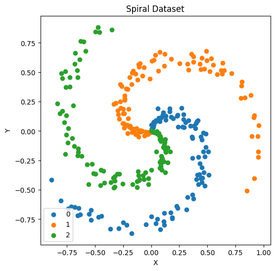

# Assignment 4 C -level

## How shall the confusion matrix be interpreted? What does it tell us that the accuracy metric doesn’t?  

Accuracy is a measure of how many of each category were correctly classified. In the case where for example 8 category 0, 11 category 1 and 19 category 2 were correctly classified (i.e. the diagonal row from top left in the SGD confusion matrix shown above) out of a total of 60 data points, the accuracy will be 8+11+19/60=0.63

In real life it is of value to know more about the classification results and the confusion matrix can supply such information in terms of true positives, false positives, true negatives and false negatives i.e:

- TP - how many items were correctly classified as belonging to a class
- TN - how many items were correctly classified as not belonging to a certain class
- FP - how many items were incorrectly classified as belonging to a certain class
- FN - how many items were not labelled as belonging to a certain class but should have been
