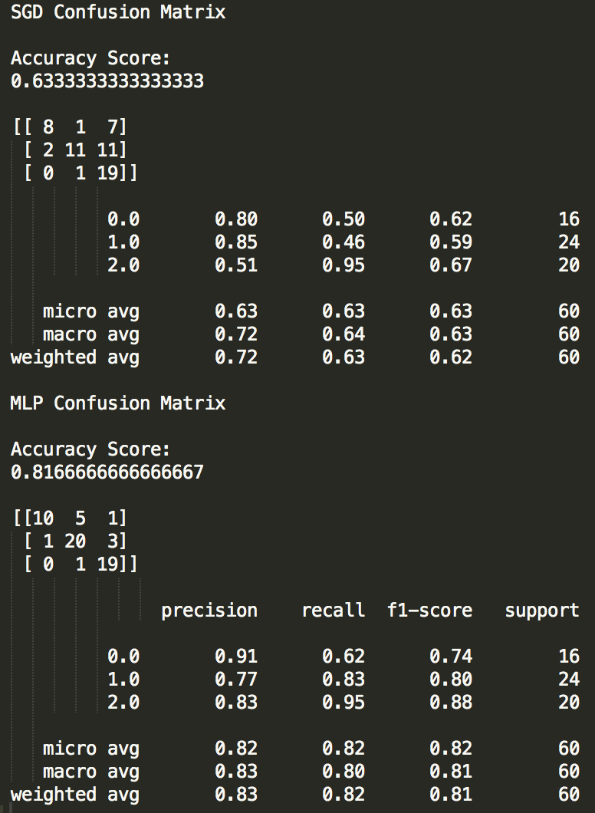

# Assignment 4 C -level

## How shall the confusion matrix be interpreted? What does it tell us that the accuracy metric doesn’t?  

Accuracy is a measure of how many of each category were correctly classified. In the case where for example 12 category 0, 12 category 1 and 10 category 2 were correctly classified out of a total of 60 data points, the accuracy will be 12+12+10/60.

In real life it is of value to know more about the classification results and the confusion matrix can supply such information in terms of true positives, false positives, true negatives and false negatives.  
